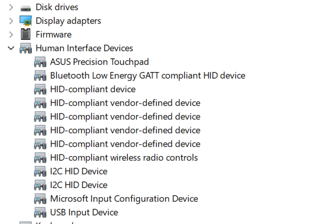
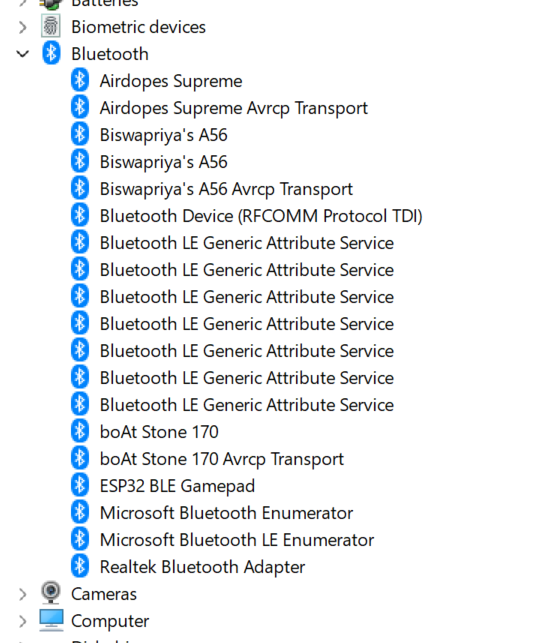

# 🎮 ESP32 Virtual Gamepad

Transform your ESP32 into a fully functional **Xbox 360 Controller** for PC! Play any modern PC game using your custom-built physical controller via Bluetooth or USB.

## ✨ Features
* **Dual Connection Modes:** Connect over **Bluetooth** (DInput) or via **USB** (Serial).
* **Native Xbox 360 Emulation:** Uses `ViGEmBus` to trick Windows into thinking a real Xbox 360 controller is plugged in. Compatible with Steam, Epic Games, and all modern PC titles.
* **Smart UI & Live Feedback:** See your joystick movements and button presses instantly in the desktop app!
* **Hardware Button Mapper:** Swap A/B/X/Y and invert joystick axes directly from the UI without needing to rewrite or flash your ESP32 code.
* **Stealth Mode:** Minimizes cleanly to your Windows System Tray so it doesn't clutter your taskbar while you game.
* **Firmware Flashing Hub:** Flash the USB or Bluetooth code to your ESP32 with the click of a button right from the app.

## 📥 Installation

1. Go to the [Releases Page](https://github.com/Biswa717-sudo/esp32-virtual-gamepad/releases) and download the **latest `ESP32_Gamepad_Setup.exe` installer**.
2. Run the installer to automatically set up the app on your computer.
3. Open the app, click **"Download / Update ViGEmBus Driver"**, and run the automatic driver installer. *(This creates the virtual Xbox controller inside Windows).*
4. Connect your ESP32 via Bluetooth or select your USB port, and start gaming!

